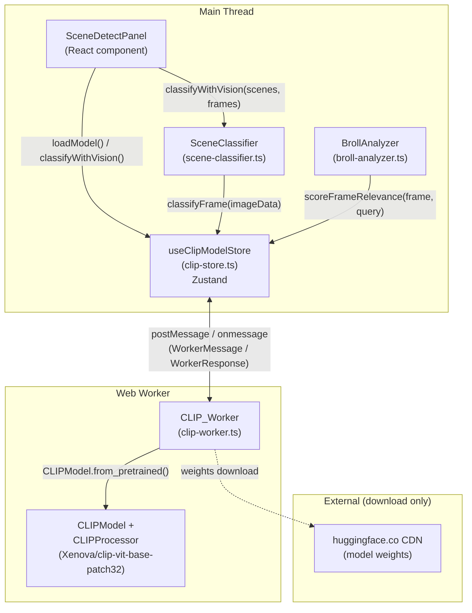

# Design Document: CLIP Visual Scene Classification

## Overview

This feature integrates a CLIP vision-language model (`Xenova/clip-vit-base-patch32`) into
OpenCut's `apps/web-vite/` SPA to enable visual scene understanding. Instead of relying solely
on transcript keywords, the system classifies video frames by what they actually contain.

All inference runs entirely in the browser via a dedicated Web Worker using
`@huggingface/transformers`. WebGPU is the primary backend; WASM is the fallback. No pixel data
or derived embeddings leave the browser process.

The existing public interfaces of `SceneClassifier` and `BrollAnalyzer` are preserved unchanged.
CLIP is an additive, opt-in enhancement surfaced through new methods and a new UI toggle in
`SceneDetectPanel`.

### Key design decisions

- **Worker isolation**: CLIP inference is CPU/GPU-intensive. Running it in a dedicated worker
  keeps the main thread and React rendering responsive, matching the pattern already used by
  `ai-worker.js` and the transcription worker.
- **Zustand store as the bridge**: A Zustand store (`useClipModelStore`) owns the worker
  reference and exposes Promise-based methods to the rest of the app, following the
  `useAiModelStore` pattern exactly.
- **Additive, not breaking**: `classify()` and `analyze()` signatures are untouched. New methods
  (`classifyWithVision`, `scoreFrameRelevance`, `enrichWithVisualConfidence`) are added alongside
  them.
- **Opt-in UI**: The panel never auto-loads the model. The user must explicitly click "Load CLIP
  Model" and then enable the toggle.

---

## Architecture

### Component diagram



### Data flow for visual classification

```
SceneDetectPanel
  │  afterThumbnail (data URL) → decodeDataUrl() → ImageData
  │
  ▼
SceneClassifier.classifyWithVision(scenes, frames: Map<sceneId, ImageData>)
  │
  ├─ for each scene with a matching frame:
  │    useClipModelStore.classifyFrame(imageData)
  │      ├─ embedImage(imageData)  → CLIP_Worker → number[512]
  │      ├─ embedTexts(LABEL_PROMPTS) → CLIP_Worker → number[9][512]
  │      ├─ cosineSimilarity(imgEmb, each textEmb) → scores[9]
  │      └─ softmax(scores, T=1.0) → confidence; argmax → category
  │
  └─ for each scene without a matching frame:
       existing categorizeScene() keyword logic
```

---

## Components and Interfaces

### 1. Typed message protocol

The worker and store communicate through a fully discriminated union. This mirrors the pattern
in `services/transcription/worker.ts`.

```typescript
// src/ai/clip-worker.ts  (also imported by clip-store.ts)

export type WorkerMessage =
  | { type: "load" }
  | { type: "embedImage"; id: string; imageData: ImageData }
  | { type: "embedTexts"; id: string; texts: string[] };

export type WorkerResponse =
  | { type: "progress"; progress: number }          // progress ∈ [0, 100]
  | { type: "ready" }
  | { type: "error"; message: string }
  | { type: "embedImageResult"; id: string; embedding: number[] }
  | { type: "embedTextsResult"; id: string; embeddings: number[][] };
```

The `id` field on inference messages is a `crypto.randomUUID()` string generated by the store.
The store keeps a `Map<string, { resolve, reject }>` of pending promises, keyed by `id`, so
concurrent calls are correctly demultiplexed.

### 2. CLIP_Worker (`src/ai/clip-worker.ts`)

```typescript
import { CLIPModel, CLIPProcessor, env } from "@huggingface/transformers";

const MODEL_ID = "Xenova/clip-vit-base-patch32";

let model: CLIPModel | null = null;
let processor: CLIPProcessor | null = null;

async function load(): Promise<void> { /* ... */ }
async function embedImage(id: string, imageData: ImageData): Promise<void> { /* ... */ }
async function embedTexts(id: string, texts: string[]): Promise<void> { /* ... */ }

self.onmessage = async (event: MessageEvent<WorkerMessage>) => { /* dispatch */ };
```

**Load sequence:**
1. Try `device: "webgpu"`. If `navigator.gpu` is absent or `requestAdapter()` returns null,
   fall back to `device: "wasm"`.
2. Track per-file `{ loaded, total }` in a `Map`. On each `progress` callback, recompute
   `overallPercent = totalLoaded / totalBytes * 100` and post `{ type: "progress", progress }`.
3. On success post `{ type: "ready" }`. On failure post `{ type: "error", message }`.

**embedImage:**
```typescript
const inputs = await processor(imageData);
const { image_embeds } = await model(inputs);
const embedding = l2Normalize(Array.from(image_embeds.data as Float32Array));
self.postMessage({ type: "embedImageResult", id, embedding });
```

**embedTexts:**
```typescript
const inputs = await processor(null, { text: texts, padding: true, truncation: true });
const { text_embeds } = await model(inputs);
// text_embeds shape: [texts.length, 512]
const embeddings = chunk(Array.from(text_embeds.data as Float32Array), 512)
  .map(l2Normalize);
self.postMessage({ type: "embedTextsResult", id, embeddings });
```

**Guard:** If `model` is null when an inference message arrives, post
`{ type: "error", message: "Model not loaded" }` immediately.

### 3. CLIP_Store (`src/ai/clip-store.ts`)

Follows `useAiModelStore` exactly: Zustand `create`, worker held in store state, message
handler wired in `loadModel()`.

```typescript
import { create } from "zustand";
import type { SceneCategory } from "@/ai/scene-classifier";
import type { WorkerMessage, WorkerResponse } from "./clip-worker";

export type ModelStage =
  | "idle" | "checking" | "downloading" | "loading" | "ready" | "error";

interface ClipModelState {
  stage: ModelStage;
  progress: number;
  error: string | null;
  worker: Worker | null;
}

interface ClipModelStore extends ClipModelState {
  loadModel(): void;
  terminateWorker(): void;
  embedImage(imageData: ImageData): Promise<number[]>;
  embedTexts(texts: string[]): Promise<number[][]>;
  classifyFrame(imageData: ImageData): Promise<{ category: SceneCategory; confidence: number }>;
}

export const useClipModelStore = create<ClipModelStore>((set, get) => ({ /* ... */ }));
```

**Pending-promise map** (module-level, not in Zustand state to avoid serialisation issues):
```typescript
const pending = new Map<string, { resolve: (v: unknown) => void; reject: (e: Error) => void }>();
```

**loadModel():**
1. If `worker` already exists, reuse it.
2. Otherwise `new Worker(new URL("./clip-worker.ts", import.meta.url), { type: "module" })`.
3. Wire `worker.onmessage` to dispatch on `WorkerResponse.type`.
4. Set `stage: "downloading"`, `progress: 0`, `error: null`.
5. Post `{ type: "load" }`.

**embedImage / embedTexts:**
```typescript
embedImage(imageData) {
  const { stage, worker } = get();
  if (stage !== "ready") return Promise.reject(new Error("CLIP model not ready"));
  const id = crypto.randomUUID();
  return new Promise((resolve, reject) => {
    pending.set(id, { resolve, reject });
    worker!.postMessage({ type: "embedImage", id, imageData } satisfies WorkerMessage);
  });
}
```

**classifyFrame(imageData):**
```typescript
async classifyFrame(imageData) {
  const [imgEmb, textEmbs] = await Promise.all([
    get().embedImage(imageData),
    get().embedTexts(Object.values(LABEL_PROMPTS)),
  ]);
  const scores = textEmbs.map(t => cosineSimilarity(imgEmb, t));
  const probs = softmax(scores, /* temperature */ 1.0);
  const best = argmax(probs);
  const categories = Object.keys(LABEL_PROMPTS) as SceneCategory[];
  return { category: categories[best], confidence: probs[best] };
}
```

### 4. SceneClassifier additions (`src/ai/scene-classifier.ts`)

New method added to the existing `SceneClassifier` class:

```typescript
async classifyWithVision(
  scenes: SceneChange[],
  frames: Map<string, ImageData>,
  transcript?: WordTranscript,
  videoDuration?: number,
): Promise<ClassifiedScene[]>
```

**Implementation sketch:**
```typescript
async classifyWithVision(scenes, frames, transcript, videoDuration) {
  const store = useClipModelStore.getState();
  if (store.stage !== "ready") {
    return this.classify(scenes, transcript, videoDuration);
  }

  const words = transcript?.words ?? [];
  const classified: ClassifiedScene[] = [];

  for (let i = 0; i < scenes.length; i++) {
    const scene = scenes[i];
    const nextScene = scenes[i + 1];
    const startTime = scene.timestamp;
    const endTime = nextScene?.timestamp ?? (videoDuration ?? startTime + 5);
    const snippet = this.getTranscriptSnippet(words, startTime, endTime);
    const sceneId = `scene-${i}`;

    let category: SceneCategory;
    let confidence: number;

    const frame = frames.get(sceneId);
    if (frame) {
      const result = await store.classifyFrame(frame);
      category = result.category;
      confidence = result.confidence;
    } else {
      category = this.categorizeScene(scene, snippet, i, scenes.length, videoDuration);
      confidence = this.computeConfidence(scene, snippet, category);
    }

    const { isHighlight, reason } = this.isHighlightCandidate(scene, snippet, category);

    classified.push({
      id: sceneId, startTime, endTime,
      type: scene.type, category, confidence,
      transcriptSnippet: snippet, isHighlight, highlightReason: reason,
    });
  }

  return classified;
}
```

`classify()` and `generateHighlightReel()` are **not modified**.

### 5. BrollAnalyzer additions (`src/broll/broll-analyzer.ts`)

Two new methods added to the existing `BrollAnalyzer` class:

```typescript
async scoreFrameRelevance(frame: ImageData, query: string): Promise<number>
async enrichWithVisualConfidence(
  suggestions: BrollSuggestion[],
  getFrame: (startTime: number) => Promise<ImageData | null>,
): Promise<BrollSuggestion[]>
```

**scoreFrameRelevance:**
```typescript
async scoreFrameRelevance(frame, query) {
  const store = useClipModelStore.getState();
  if (store.stage !== "ready") return 0.5;
  const [imgEmb, [textEmb]] = await Promise.all([
    store.embedImage(frame),
    store.embedTexts([query]),
  ]);
  const sim = cosineSimilarity(imgEmb, textEmb); // ∈ [-1, 1]
  return (sim + 1) / 2;                          // mapped to [0, 1]
}
```

**enrichWithVisualConfidence:**
```typescript
async enrichWithVisualConfidence(suggestions, getFrame) {
  const enriched = suggestions.map(s => ({ ...s }));
  for (const s of enriched) {
    const frame = await getFrame(s.startTime);
    if (frame === null) continue;
    const visual = await this.scoreFrameRelevance(frame, s.semanticQuery);
    s.confidence = (s.confidence + visual) / 2;
  }
  return enriched;
}
```

`analyze()` is **not modified**.

### 6. SceneDetectPanel additions (`src/scene-detection/components/SceneDetectPanel.tsx`)

New state variables added to the existing component:

```typescript
const clipStage = useClipModelStore((s) => s.stage);
const clipProgress = useClipModelStore((s) => s.progress);
const clipError = useClipModelStore((s) => s.error);
const { loadModel, classifyFrame } = useClipModelStore();

const [visionEnabled, setVisionEnabled] = useState(false);
const [classifiedScenes, setClassifiedScenes] = useState<ClassifiedScene[]>([]);
const [isClassifying, setIsClassifying] = useState(false);
const [classifyError, setClassifyError] = useState<string | null>(null);
```

**Decoding `afterThumbnail` data URL to `ImageData`:**

`SceneChange.afterThumbnail` is a JPEG data URL produced by `imageDataToThumbnail()` in
`scene-detector.ts` (160 px max dimension, quality 0.7). To recover an `ImageData` for CLIP:

```typescript
async function decodeDataUrl(dataUrl: string): Promise<ImageData> {
  return new Promise((resolve, reject) => {
    const img = new Image();
    img.onload = () => {
      const canvas = document.createElement("canvas");
      canvas.width = img.naturalWidth;
      canvas.height = img.naturalHeight;
      const ctx = canvas.getContext("2d")!;
      ctx.drawImage(img, 0, 0);
      resolve(ctx.getImageData(0, 0, canvas.width, canvas.height));
    };
    img.onerror = reject;
    img.src = dataUrl;
  });
}
```

This runs on the main thread before the `ImageData` is passed to `classifyWithVision`. The
decoded `ImageData` is never stored beyond the classification call.

**Post-detection classification trigger** (inside `handleDetect`, after `setScenes(results)`):

```typescript
if (visionEnabled && clipStage === "ready" && results.length > 0) {
  setIsClassifying(true);
  setClassifyError(null);
  try {
    const frames = new Map<string, ImageData>();
    for (let i = 0; i < results.length; i++) {
      const thumb = results[i].afterThumbnail;
      if (thumb) frames.set(`scene-${i}`, await decodeDataUrl(thumb));
    }
    const classifier = new SceneClassifier();
    const classified = await classifier.classifyWithVision(results, frames);
    setClassifiedScenes(classified);
  } catch (err) {
    setClassifyError(err instanceof Error ? err.message : "Classification failed");
  } finally {
    setIsClassifying(false);
  }
}
```

**New UI elements added to the existing panel layout:**

1. **Model load section** (shown when `clipStage === "idle"`):
   ```tsx
   <button onClick={() => loadModel()}>Load CLIP Model (~150 MB)</button>
   ```

2. **Download progress bar** (shown when `clipStage === "downloading" | "loading"`):
   ```tsx
   <div className="h-1 bg-muted rounded overflow-hidden">
     <div className="h-full bg-primary" style={{ width: `${clipProgress}%` }} />
   </div>
   ```

3. **Error + retry** (shown when `clipStage === "error"`):
   ```tsx
   <p className="text-xs text-destructive">{clipError}</p>
   <button onClick={() => loadModel()}>Retry</button>
   ```

4. **Toggle** (shown always, disabled unless `clipStage === "ready"`):
   ```tsx
   <label>
     <input type="checkbox" checked={visionEnabled}
       onChange={e => setVisionEnabled(e.target.checked)}
       disabled={clipStage !== "ready"} />
     Visual Classification (CLIP)
   </label>
   ```

5. **Per-scene category + highlight badge** (added to existing scene card):
   ```tsx
   {classifiedScenes[index] && (
     <>
       <span className="text-[10px] text-primary">{classifiedScenes[index].category}</span>
       {classifiedScenes[index].isHighlight && (
         <span className="text-[10px] bg-yellow-500/20 text-yellow-600 px-1 rounded">★ highlight</span>
       )}
     </>
   )}
   ```

---

## Data Models

### Label_Prompt mapping

```typescript
// src/ai/clip-store.ts
import type { SceneCategory } from "@/ai/scene-classifier";

export const LABEL_PROMPTS: Record<SceneCategory, string> = {
  "talking-head": "a person talking directly to camera",
  "b-roll":       "cinematic b-roll footage of a scene or environment",
  "action":       "fast-paced action or movement sequence",
  "transition":   "a video transition or dissolve effect",
  "silent":       "a static or near-static scene with no movement",
  "music":        "a music performance or concert",
  "intro":        "an introduction title card or opening sequence",
  "outro":        "an outro, end card, or closing sequence",
  "unknown":      "an unclassifiable or ambiguous scene",
};
```

The order of `Object.keys(LABEL_PROMPTS)` is the canonical order used when indexing into the
`textEmbs` array returned by `embedTexts`. TypeScript's `Record<SceneCategory, string>` ensures
all 9 categories are always present at compile time.

### Cosine similarity and softmax

```typescript
/** Both vectors must already be L2-normalised (unit norm). */
function cosineSimilarity(a: number[], b: number[]): number {
  let dot = 0;
  for (let i = 0; i < a.length; i++) dot += a[i] * b[i];
  return dot; // equals cos(θ) when both are unit vectors
}

/** Standard softmax at temperature T. */
function softmax(scores: number[], temperature = 1.0): number[] {
  const scaled = scores.map(s => s / temperature);
  const maxVal = Math.max(...scaled);                    // numerical stability
  const exps = scaled.map(s => Math.exp(s - maxVal));
  const sum = exps.reduce((a, b) => a + b, 0);
  return exps.map(e => e / sum);
}

function argmax(arr: number[]): number {
  return arr.reduce((best, v, i) => (v > arr[best] ? i : best), 0);
}

/** L2-normalise a vector in place (returns new array). */
function l2Normalize(v: number[]): number[] {
  const norm = Math.sqrt(v.reduce((s, x) => s + x * x, 0)) || 1;
  return v.map(x => x / norm);
}
```

Because both the image embedding and each text embedding are L2-normalised before being
returned from the worker, `cosineSimilarity` reduces to a simple dot product. The softmax at
`temperature = 1.0` converts the 9 raw similarity scores into a probability distribution; the
winning label's probability is used as `confidence`.

### ModelStage transitions

```
idle ──loadModel()──► downloading ──progress──► downloading
                                  ──ready──────► ready
                                  ──error──────► error ──loadModel()──► downloading
ready ──terminateWorker()──► idle
```

---

## Correctness Properties

*A property is a characteristic or behavior that should hold true across all valid executions of
a system — essentially, a formal statement about what the system should do. Properties serve as
the bridge between human-readable specifications and machine-verifiable correctness guarantees.*

### Property 1: Progress values are always in [0, 100]

*For any* sequence of `(loaded, total)` file-progress pairs where `total > 0`, the computed
`overallPercent = totalLoaded / totalBytes * 100` must be a number in the closed interval
`[0, 100]`.

**Validates: Requirements 1.3**

---

### Property 2: Embedding output is a fixed-dimension unit-norm vector

*For any* valid `ImageData` (arbitrary width, height, pixel values), `embedImage` returns a
`number[]` of length 512 whose L2 norm is within floating-point epsilon of 1.0. Equivalently,
*for any* non-empty `string[]` of length `n`, `embedTexts` returns a `number[][]` of length `n`
where each element has length 512 and L2 norm ≈ 1.0.

**Validates: Requirements 1.6, 1.7, 2.7, 2.8**

---

### Property 3: Non-ready stage rejects all inference calls

*For any* `ModelStage` value that is not `"ready"` (i.e. `"idle"`, `"checking"`,
`"downloading"`, `"loading"`, or `"error"`), calling `embedImage`, `embedTexts`, or
`classifyFrame` on the store must return a rejected `Promise` with an error message indicating
the model is not ready.

**Validates: Requirements 1.8, 2.9, 3.6**

---

### Property 4: classifyFrame returns a valid SceneCategory with confidence in [0, 1]

*For any* `ImageData`, `classifyFrame` resolves to an object `{ category, confidence }` where
`category` is one of the 9 `SceneCategory` values and `confidence` is a number in `[0, 1]`.

**Validates: Requirements 3.1, 3.4**

---

### Property 5: classifyFrame selects the argmax cosine similarity category

*For any* image embedding vector `imgEmb` and any set of 9 text embedding vectors `textEmbs`,
the `category` returned by `classifyFrame` must be the `SceneCategory` at index
`argmax(textEmbs.map(t => cosineSimilarity(imgEmb, t)))`.

**Validates: Requirements 3.3**

---

### Property 6: Softmax output sums to 1 and each value is in [0, 1]

*For any* vector of 9 real-valued cosine similarity scores, `softmax(scores, 1.0)` returns a
vector of length 9 where every element is in `[0, 1]` and the sum of all elements is within
floating-point epsilon of 1.0.

**Validates: Requirements 3.4**

---

### Property 7: classifyWithVision uses CLIP result when frame available, keyword result otherwise

*For any* `SceneChange[]` and `Map<string, ImageData>`, for each scene `i`:
- If `frames.has("scene-i")`, the returned `ClassifiedScene.category` equals the `category`
  returned by `classifyFrame` for that frame.
- If `frames` does not contain `"scene-i"`, the returned `ClassifiedScene.category` equals
  what `classify()` would return for that scene.

**Validates: Requirements 4.4, 4.5, 4.6**

---

### Property 8: classifyWithVision falls back to classify() when stage is not ready

*For any* `ModelStage` that is not `"ready"`, calling `classifyWithVision` with any scenes and
frames must return the same result as calling `classify()` with the same scenes, transcript, and
videoDuration.

**Validates: Requirements 4.7**

---

### Property 9: isHighlight is always derived from isHighlightCandidate regardless of classification path

*For any* classified scene produced by either `classify()` or `classifyWithVision()`, the
`isHighlight` field must equal the value that `isHighlightCandidate(scene, snippet, category)`
returns for that scene's final `category` and `transcriptSnippet`.

**Validates: Requirements 4.8**

---

### Property 10: scoreFrameRelevance output is always in [0, 1]

*For any* `ImageData` and any `string` query, `scoreFrameRelevance` resolves to a number in
the closed interval `[0, 1]`.

**Validates: Requirements 5.2**

---

### Property 11: scoreFrameRelevance maps cosine similarity linearly from [-1, 1] to [0, 1]

*For any* cosine similarity value `s ∈ [-1, 1]` (the dot product of two unit-norm embeddings),
`scoreFrameRelevance` returns `(s + 1) / 2`.

**Validates: Requirements 5.3**

---

### Property 12: scoreFrameRelevance returns 0.5 when stage is not ready

*For any* `ModelStage` that is not `"ready"`, `scoreFrameRelevance` resolves to exactly `0.5`
regardless of the `ImageData` or query string provided.

**Validates: Requirements 5.4**

---

### Property 13: enrichWithVisualConfidence confidence update is correct for all suggestions

*For any* `BrollSuggestion[]` and `getFrame` function:
- If `getFrame(s.startTime)` returns a non-null `ImageData`, the updated `confidence` for
  suggestion `s` equals `(s.confidence + scoreFrameRelevance(frame, s.semanticQuery)) / 2`.
- If `getFrame(s.startTime)` returns `null`, `s.confidence` is unchanged.

**Validates: Requirements 5.7, 5.8**

---

## Error Handling

| Failure point | Behaviour |
|---|---|
| WebGPU unavailable | Worker falls back to WASM device silently; no error posted |
| Model download fails | Worker posts `{ type: "error", message }`. Store sets `stage: "error"`. Panel shows error + Retry button. |
| `embedImage` / `embedTexts` called before ready | Worker posts `{ type: "error", message: "Model not loaded" }`. Store rejects the pending promise. |
| `classifyFrame` called before ready | Store rejects immediately without contacting worker. |
| `classifyWithVision` called before ready | Falls back to `classify()` — no error surfaced to caller. |
| `scoreFrameRelevance` called before ready | Resolves to `0.5` — neutral fallback, no error surfaced. |
| `decodeDataUrl` fails (corrupt thumbnail) | `Promise` rejects; `handleDetect` catches it and sets `classifyError`. Panel shows inline error. |
| Worker crashes unexpectedly | `worker.onerror` fires; store sets `stage: "error"`. All pending promises are rejected. |
| `terminateWorker` called mid-download | Worker is terminated immediately. All pending promises are rejected with "Worker terminated". |

**Pending-promise cleanup on error:**

When the store receives `{ type: "error" }` from the worker, it iterates `pending` and rejects
all outstanding promises before clearing the map. This prevents memory leaks and hanging
`await` calls.

```typescript
case "error": {
  const err = new Error(msg.message);
  for (const { reject } of pending.values()) reject(err);
  pending.clear();
  set({ stage: "error", error: msg.message });
  break;
}
```

---

## Testing Strategy

### Property-based testing library

Use **fast-check** (`npm install --save-dev fast-check`), which is the standard PBT library for
TypeScript/JavaScript. Each property test runs a minimum of **100 iterations**.

Tag format for each test:
```
// Feature: clip-scene-classification, Property N: <property text>
```

### Unit tests (example-based)

Located in `src/ai/__tests__/` and `src/broll/__tests__/`.

| Test | What it verifies |
|---|---|
| Store initialises with `stage: "idle"`, `progress: 0`, `error: null` | Req 2.1, 2.2 |
| `loadModel()` sets `stage: "downloading"` and posts `{type:"load"}` | Req 2.3 |
| Simulated `ready` message sets `stage: "ready"` and `progress: 100` | Req 2.5 |
| `terminateWorker()` terminates worker and resets `stage: "idle"` | Req 2.10 |
| `LABEL_PROMPTS` contains exactly 9 entries with the specified strings | Req 3.5 |
| `classifyWithVision` exists and returns `Promise<ClassifiedScene[]>` | Req 4.3 |
| `enrichWithVisualConfidence` exists and returns `Promise<BrollSuggestion[]>` | Req 5.5 |
| Panel renders "Load CLIP Model" button when `stage === "idle"` | Req 6.6 |
| Panel renders progress bar when `stage === "downloading"` | Req 6.7 |
| Panel renders error + Retry when `stage === "error"` | Req 6.8 |
| Panel does NOT call `loadModel()` on mount | Req 6.9 |
| Toggle is disabled when `stage !== "ready"` | Req 6.1 |
| Panel calls `classifyWithVision` after detection when toggle is on | Req 6.2 |
| Panel renders category label and highlight badge per scene | Req 6.3 |

### Property-based tests

```typescript
import fc from "fast-check";

// Feature: clip-scene-classification, Property 1: Progress values are always in [0, 100]
test("P1: progress computation is always in [0, 100]", () => {
  fc.assert(fc.property(
    fc.array(fc.record({ loaded: fc.nat(), total: fc.nat({ min: 1 }) }), { minLength: 1 }),
    (files) => {
      const totalLoaded = files.reduce((s, f) => s + Math.min(f.loaded, f.total), 0);
      const totalBytes = files.reduce((s, f) => s + f.total, 0);
      const pct = (totalLoaded / totalBytes) * 100;
      return pct >= 0 && pct <= 100;
    }
  ), { numRuns: 100 });
});

// Feature: clip-scene-classification, Property 6: Softmax output sums to 1 and each value in [0,1]
test("P6: softmax output is a valid probability distribution", () => {
  fc.assert(fc.property(
    fc.array(fc.float({ min: -1, max: 1 }), { minLength: 9, maxLength: 9 }),
    (scores) => {
      const probs = softmax(scores, 1.0);
      const allInRange = probs.every(p => p >= 0 && p <= 1);
      const sumsToOne = Math.abs(probs.reduce((a, b) => a + b, 0) - 1.0) < 1e-6;
      return allInRange && sumsToOne;
    }
  ), { numRuns: 100 });
});

// Feature: clip-scene-classification, Property 11: scoreFrameRelevance linear mapping
test("P11: cosine similarity is linearly mapped to [0,1]", () => {
  fc.assert(fc.property(
    fc.float({ min: -1, max: 1 }),
    (sim) => {
      const score = (sim + 1) / 2;
      return score >= 0 && score <= 1 && Math.abs(score - (sim + 1) / 2) < 1e-10;
    }
  ), { numRuns: 100 });
});

// Feature: clip-scene-classification, Property 13: enrichWithVisualConfidence confidence update
test("P13: confidence is averaged when frame is non-null, unchanged when null", () => {
  fc.assert(fc.property(
    fc.float({ min: 0, max: 1 }),
    fc.float({ min: 0, max: 1 }),
    fc.boolean(),
    (original, visual, frameIsNull) => {
      const expected = frameIsNull ? original : (original + visual) / 2;
      return Math.abs(expected - (frameIsNull ? original : (original + visual) / 2)) < 1e-10;
    }
  ), { numRuns: 100 });
});
```

Properties 2, 3, 4, 5, 7, 8, 9, 10, 12 require mocking the worker/store and are implemented
as async property tests using `fc.asyncProperty`.

### Integration tests

- Worker loads model with mocked `navigator.gpu` present → uses WebGPU device.
- Worker loads model with `navigator.gpu` absent → falls back to WASM device.
- End-to-end: `SceneDetectPanel` with a real video file, CLIP model mocked, verifies the full
  detect → classify → render pipeline.

### Privacy verification

Static analysis / code review checklist (not automated tests):
- `clip-worker.ts` contains no `fetch`, `XMLHttpRequest`, or `WebSocket` calls that reference
  `imageData` or `embedding` variables.
- `clip-store.ts` contains no `localStorage.setItem`, `indexedDB`, or `sessionStorage` calls.
- `SceneClassifier` and `BrollAnalyzer` pass `ImageData` only to `useClipModelStore` methods,
  never to any network function.
