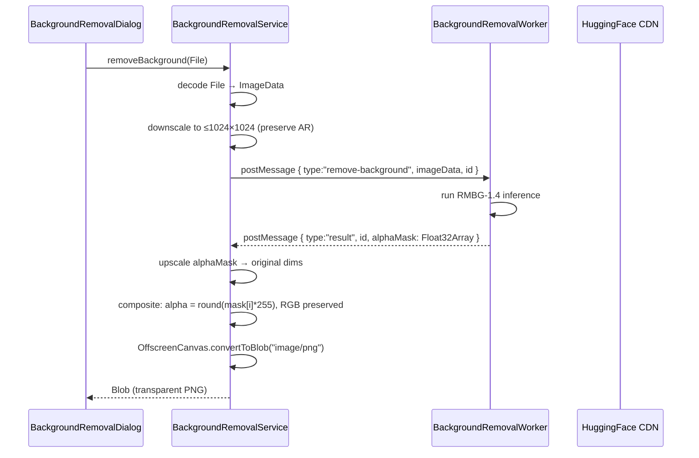
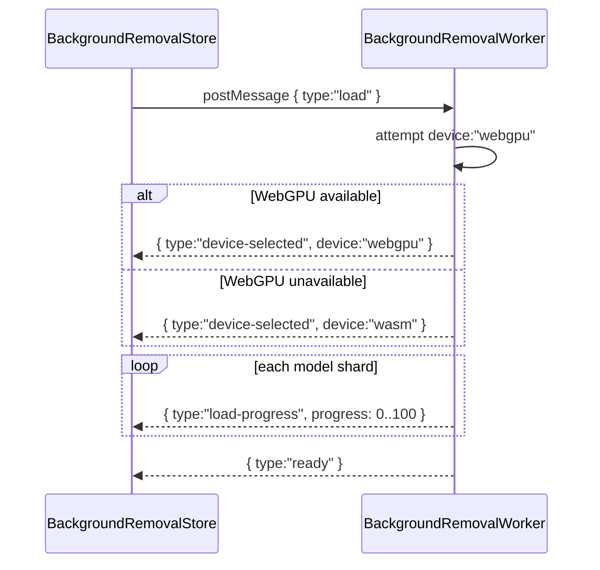

# Design Document: Local Background Removal

## Overview

This design replaces the `@imgly/background-removal` dependency with a fully local, on-device background removal engine. The engine loads the `briaai/RMBG-1.4` ONNX model via `@huggingface/transformers`, runs all inference inside a dedicated Web Worker, and returns a transparent-background PNG `Blob` without any user pixel data leaving the browser process.

The implementation introduces four new files under `src/background-removal/` and modifies two existing files:

| File | Role |
|---|---|
| `src/background-removal/types.ts` | Discriminated union types for the worker protocol |
| `src/background-removal/worker.ts` | Web Worker — model loading, device selection, inference |
| `src/background-removal/service.ts` | Main-thread service — image preprocessing, worker bridge, PNG encoding |
| `src/background-removal/store.ts` | Zustand store — model lifecycle state for React components |
| `src/background-removal/components/BackgroundRemovalDialog.tsx` | Updated to use local service |
| `src/ai/segmentation.ts` | Updated to delegate to `BackgroundRemovalService` |

`@huggingface/transformers` is already present in `package.json` (used by the transcription service). `@imgly/background-removal` is removed.

---

## Architecture

### Component Diagram

```mermaid
graph TD
    subgraph Main Thread
        Dialog["BackgroundRemovalDialog\n(React component)"]
        Store["useBackgroundRemovalStore\n(Zustand)"]
        Service["BackgroundRemovalService\n(singleton)"]
        Seg["SegmentationService\n(delegates to Service)"]
    end

    subgraph Web Worker [Web Worker — background-removal/worker.ts]
        WLoader["Model Loader\n(pipeline / AutoModel)"]
        WInfer["Inference Handler\n(RMBG-1.4)"]
        WDevice["Device Selector\n(WebGPU → WASM)"]
    end

    subgraph External
        HF["HuggingFace Hub CDN\n(model weights only)"]
        Cache["Browser Cache Storage\n(cached model shards)"]
    end

    Dialog -->|reads stage/progress/error| Store
    Dialog -->|calls removeBackground()| Service
    Seg -->|calls removeBackground()\nremoveBackgroundFromFrames()| Service
    Store -->|owns Worker ref\npostMessage load| WLoader
    Service -->|postMessage remove-background| WInfer
    WLoader -->|fetch model shards| HF
    HF -->|cached in| Cache
    WDevice -->|post device-selected| Store
    WInfer -->|post result alphaMask| Service
```

### Data Flow — Single Image



### Model Loading Flow



---

## Components and Interfaces

### `src/background-removal/types.ts`

All worker communication uses typed discriminated unions, following the pattern in `src/services/transcription/worker.ts`.

```typescript
// Messages sent FROM main thread TO worker
export type WorkerMessage =
  | { type: "load" }
  | { type: "remove-background"; id: string; imageData: ImageData }
  | { type: "cancel" };

// Messages sent FROM worker TO main thread
export type WorkerResponse =
  | { type: "device-selected"; device: "webgpu" | "wasm" }
  | { type: "load-progress"; progress: number }           // integer [0, 100]
  | { type: "load-retry"; attempt: number; maxRetries: number; delay: number; url: string }
  | { type: "ready" }
  | { type: "result"; id: string; alphaMask: Float32Array; width: number; height: number }
  | { type: "cancelled" }
  | { type: "error"; error: string };
```

The `result` response carries `width` and `height` alongside the `alphaMask` so the service can upscale without storing inference dimensions separately.

### `src/background-removal/worker.ts`

```typescript
const MODEL_ID = "briaai/RMBG-1.4";   // single constant — easy to upgrade
const MAX_RETRIES = 5;
const BASE_DELAY = 2000; // ms
```

Responsibilities:
- Import `@huggingface/transformers` dynamically (same pattern as `ai-worker.js`)
- Set `env.allowLocalModels = false`
- Wrap `env.fetch` with exponential-backoff retry, posting `load-retry` on each attempt
- Attempt `device: "webgpu"` first; catch and fall back to `device: "wasm"`
- Post `device-selected` after device is determined
- Load model via `AutoModel.from_pretrained` + `AutoProcessor.from_pretrained` with `progress_callback` that aggregates byte-weighted progress across all shards
- On `remove-background` message: run inference, post `result` with `Float32Array` alphaMask
- On `cancel` message: set a cancellation flag, post `cancelled`
- Catch all unhandled errors and post `{ type: "error", error: string }`

### `src/background-removal/service.ts`

```typescript
export class BackgroundRemovalService {
  private worker: Worker | null = null;
  private pendingRequests = new Map<string, {
    resolve: (mask: Float32Array & { width: number; height: number }) => void;
    reject: (err: Error) => void;
  }>();

  setWorker(worker: Worker): void;

  async removeBackground(input: File | ImageData): Promise<Blob>;

  async removeBackgroundFromFrames(
    frames: ImageData[],
    options?: { signal?: AbortSignal; onProgress?: (n: number) => void }
  ): Promise<Blob[]>;

  private async decodeFile(file: File): Promise<ImageData>;
  private resizeImageData(src: ImageData, maxDim: number): ImageData;
  private upscaleAlphaMask(
    mask: Float32Array, maskW: number, maskH: number,
    targetW: number, targetH: number
  ): Float32Array;
  private applyAlphaMask(original: ImageData, alphaMask: Float32Array): ImageData;
  private encodeAsPng(composited: ImageData): Promise<Blob>;
  private sendToWorker(imageData: ImageData): Promise<{ alphaMask: Float32Array; width: number; height: number }>;
}

export const backgroundRemovalService = new BackgroundRemovalService();
```

Key implementation notes:
- `decodeFile` draws the `File` onto an `OffscreenCanvas` (or `<canvas>`) and calls `getImageData`
- `resizeImageData` uses `OffscreenCanvas` with `drawImage` for hardware-accelerated downscaling; preserves aspect ratio so neither dimension exceeds 1024
- `upscaleAlphaMask` uses nearest-neighbour interpolation (sufficient for a single-channel mask)
- `applyAlphaMask`: `alpha = Math.round(alphaMask[i] * 255)`, RGB channels copied unchanged
- `encodeAsPng`: tries `OffscreenCanvas.convertToBlob({ type: "image/png" })`; falls back to `HTMLCanvasElement.toBlob` if `OffscreenCanvas` is unavailable
- `sendToWorker` generates a `nanoid` request ID, stores a `Promise` resolver in `pendingRequests`, posts the message, and resolves when the matching `result` response arrives
- `removeBackgroundFromFrames` processes frames sequentially (one at a time) to avoid GPU memory exhaustion; checks `signal.aborted` before each frame; calls `onProgress` after each frame

### `src/background-removal/store.ts`

Follows the exact structural pattern of `src/ai/ai-model-store.ts`.

```typescript
import { create } from "zustand";
import type { ModelStage } from "@/ai/ai-model-store";

interface BackgroundRemovalState {
  stage: ModelStage;
  progress: number;
  error: string | null;
  device: "webgpu" | "wasm" | null;
  worker: Worker | null;
}

interface BackgroundRemovalStore extends BackgroundRemovalState {
  initWorker: () => void;
  terminateWorker: () => void;
  loadModel: () => void;
  clearError: () => void;
}

export const useBackgroundRemovalStore = create<BackgroundRemovalStore>((set, get) => ({
  stage: "idle",
  progress: 0,
  error: null,
  device: null,
  worker: null,

  initWorker: () => { /* create Worker, attach message handler, post { type:"load" } */ },
  terminateWorker: () => { /* worker.terminate(), set worker: null */ },
  loadModel: () => { /* set stage:"downloading", post { type:"load" } */ },
  clearError: () => { /* set error: null, stage: "idle" if was "error" */ },
}));
```

The message handler inside `initWorker` maps `WorkerResponse` types to store state:

| WorkerResponse type | Store update |
|---|---|
| `device-selected` | `device = response.device` |
| `load-progress` | `stage = "downloading"`, `progress = response.progress` |
| `load-retry` | no stage change; could surface via a separate `retryInfo` field |
| `ready` | `stage = "ready"`, `progress = 100` |
| `error` | `stage = "error"`, `error = response.error` |

### Updated `BackgroundRemovalDialog.tsx`

- Reads `stage`, `progress`, `error`, `device` from `useBackgroundRemovalStore`
- Calls `backgroundRemovalService.removeBackground(imageFile)` instead of `@imgly/background-removal`
- Shows a progress bar when `stage === "downloading" || stage === "loading"`
- Shows an error panel with a "Retry" button (calls `store.loadModel()`) when `stage === "error"`
- Preserves the existing before/after slider UX once result is available

### Updated `src/ai/segmentation.ts`

- `segmentFrame(imageData, options)` delegates to `backgroundRemovalService.removeBackground(imageData)`, decodes the returned PNG `Blob` back to `ImageData`, and wraps it in a `SegmentationMask` with `objectId: "foreground"`
- `segmentVideo(video, times, options, onProgress)` extracts frames at each timestamp, calls `backgroundRemovalService.removeBackgroundFromFrames(frames, { signal: options.signal, onProgress })`, and maps results to `Map<number, SegmentationResult>`
- `kMeansColorClustering` and `createMaskFromCluster` are deleted
- `maskToImageData()` and `maskToDataURL()` are preserved unchanged
- `SegmentationMask` and `SegmentationResult` interfaces are unchanged

---

## Data Models

### RMBG-1.4 Model Loading

RMBG-1.4 is loaded using `@huggingface/transformers` `AutoModel` + `AutoProcessor` (not the high-level `pipeline` helper, because RMBG-1.4 uses a custom `ImageMattingOutput` that the generic pipeline task does not expose cleanly):

```typescript
import { AutoProcessor, AutoModel, env, RawImage } from "@huggingface/transformers";

env.allowLocalModels = false;

const processor = await AutoProcessor.from_pretrained(MODEL_ID, { progress_callback });
const model = await AutoModel.from_pretrained(MODEL_ID, {
  dtype: "fp32",
  device: selectedDevice,   // "webgpu" | "wasm"
  progress_callback,
});
```

Inference:

```typescript
// imageData is already resized to ≤1024×1024
const image = new RawImage(imageData.data, imageData.width, imageData.height, 4);
const inputs = await processor(image);
const { output } = await model(inputs);
// output[0] is shape [1, 1, H, W], values in [0, 1]
const alphaMask = output[0].data as Float32Array; // length = H * W
```

### AlphaMask Application

```typescript
// original: ImageData at original resolution
// alphaMask: Float32Array at original resolution (after upscaling)
const out = new ImageData(original.width, original.height);
for (let i = 0; i < original.width * original.height; i++) {
  out.data[i * 4 + 0] = original.data[i * 4 + 0]; // R preserved
  out.data[i * 4 + 1] = original.data[i * 4 + 1]; // G preserved
  out.data[i * 4 + 2] = original.data[i * 4 + 2]; // B preserved
  out.data[i * 4 + 3] = Math.round(alphaMask[i] * 255); // alpha from mask
}
```

### Image Preprocessing Pipeline

```
File | ImageData
      │
      ▼
  decode to ImageData (OffscreenCanvas / <canvas>)
      │
      ▼
  if max(width, height) > 1024:
    scale = 1024 / max(width, height)
    newW = Math.round(width * scale)
    newH = Math.round(height * scale)
    draw onto OffscreenCanvas(newW, newH)
    inferenceImageData = getImageData(0, 0, newW, newH)
  else:
    inferenceImageData = original ImageData
      │
      ▼
  transfer to worker via postMessage (structured clone)
      │
      ▼
  RMBG-1.4 inference → Float32Array alphaMask [inferenceW × inferenceH]
      │
      ▼
  if downscaled:
    upscale alphaMask → [originalW × originalH] (nearest-neighbour)
      │
      ▼
  apply alphaMask to original RGBA pixels
      │
      ▼
  OffscreenCanvas(originalW, originalH).putImageData(composited)
  .convertToBlob({ type: "image/png" })
      │
      ▼
  Blob (image/png, transparent background)
```

### Exponential-Backoff Retry

Follows the pattern in `src/ai/ai-worker.js`:

```typescript
const originalFetch = env.fetch ?? globalThis.fetch.bind(globalThis);
env.fetch = async (url: string, options: RequestInit = {}) => {
  let lastError: Error;
  for (let attempt = 0; attempt <= MAX_RETRIES; attempt++) {
    try {
      const response = await originalFetch(url, options);
      if (response.ok || response.status < 500) return response;
      lastError = new Error(`HTTP ${response.status}`);
    } catch (err) {
      lastError = err as Error;
    }
    if (attempt < MAX_RETRIES) {
      const delay = BASE_DELAY * Math.pow(2, attempt);
      self.postMessage({
        type: "load-retry",
        attempt: attempt + 1,
        maxRetries: MAX_RETRIES,
        delay,
        url,
      } satisfies WorkerResponse);
      await new Promise(r => setTimeout(r, delay));
    }
  }
  throw lastError!;
};
```

### SegmentationMask Conversion

When `BackgroundRemovalService.removeBackground()` returns a PNG `Blob`, `SegmentationService.segmentFrame()` converts it:

```typescript
// decode PNG Blob → ImageData
const bitmap = await createImageBitmap(blob);
const canvas = new OffscreenCanvas(bitmap.width, bitmap.height);
const ctx = canvas.getContext("2d")!;
ctx.drawImage(bitmap, 0, 0);
const imgData = ctx.getImageData(0, 0, bitmap.width, bitmap.height);

// extract alpha channel as Uint8Array mask
const maskData = new Uint8Array(imgData.width * imgData.height);
for (let i = 0; i < maskData.length; i++) {
  maskData[i] = imgData.data[i * 4 + 3]; // alpha channel
}

const mask: SegmentationMask = {
  id: `mask-foreground-${crypto.randomUUID().slice(0, 8)}`,
  width: imgData.width,
  height: imgData.height,
  data: maskData,
  objectId: "foreground",
  confidence: 1.0,
  timestamp: performance.now(),
};
```

---

## Correctness Properties

*A property is a characteristic or behavior that should hold true across all valid executions of a system — essentially, a formal statement about what the system should do. Properties serve as the bridge between human-readable specifications and machine-verifiable correctness guarantees.*

### Property 1: AlphaMask application preserves RGB channels

*For any* `ImageData` and any `Float32Array` alphaMask of the same pixel count, applying the mask SHALL leave the R, G, and B channel values of every pixel identical to the original, and set each pixel's alpha to `Math.round(mask[i] * 255)`.

**Validates: Requirements 5.3**

---

### Property 2: Downscale then upscale preserves pixel count

*For any* `ImageData` with dimensions `W × H` where `max(W, H) > 1024`, downscaling to fit within 1024×1024 and then upscaling the resulting alphaMask back to `W × H` SHALL produce a mask of exactly `W * H` elements.

**Validates: Requirements 5.5**

---

### Property 3: Aspect ratio is preserved after downscaling

*For any* `ImageData` with dimensions `W × H` where `max(W, H) > 1024`, the downscaled dimensions `(newW, newH)` SHALL satisfy `newW / newH ≈ W / H` (within floating-point rounding) and `max(newW, newH) ≤ 1024`.

**Validates: Requirements 5.5**

---

### Property 4: Frame progress is monotonically increasing

*For any* batch of `N` frames processed by `removeBackgroundFromFrames`, the sequence of `onProgress` values emitted SHALL be strictly non-decreasing, and the final value SHALL equal 100.

**Validates: Requirements 6.1**

---

### Property 5: Abort stops processing and returns partial results

*For any* batch of `N` frames where an `AbortSignal` is triggered after `k` frames complete (`0 ≤ k < N`), `removeBackgroundFromFrames` SHALL resolve with exactly `k` `Blob` results and SHALL NOT process frames `k+1` through `N`.

**Validates: Requirements 6.3, 7.1**

---

### Property 6: PNG encoding round-trip preserves dimensions

*For any* `ImageData` with dimensions `W × H`, encoding it as a PNG `Blob` via `encodeAsPng` and then decoding that `Blob` back to an `ImageData` SHALL produce an image with the same `W × H` dimensions.

**Validates: Requirements 5.4, 7.3**

---

### Property 7: Sequential frame processing produces one output per input

*For any* non-empty array of `N` `ImageData` frames passed to `removeBackgroundFromFrames` (without aborting), the returned `Blob[]` SHALL have exactly `N` elements.

**Validates: Requirements 7.1**

---

## Error Handling

| Scenario | Handling |
|---|---|
| WebGPU unavailable | Worker catches adapter request failure, falls back to WASM, posts `device-selected` with `"wasm"` |
| Model shard download fails | Exponential-backoff retry (MAX_RETRIES=5, BASE_DELAY=2000ms); posts `load-retry` each attempt; posts `error` after exhaustion |
| Inference throws | Worker catches, posts `{ type: "error", error: message }` |
| Worker unhandled rejection | `self.addEventListener("unhandledrejection", ...)` posts `error` |
| `removeBackground` called before model ready | `BackgroundRemovalService` rejects with `"Model not ready"` |
| `AbortSignal` fired mid-batch | `removeBackgroundFromFrames` resolves with partial results collected so far |
| `OffscreenCanvas` unavailable | `encodeAsPng` falls back to `HTMLCanvasElement.toBlob` |
| File decode fails | `decodeFile` rejects; `removeBackground` propagates the rejection |

---

## Testing Strategy

### Unit Tests

Unit tests cover specific examples and edge cases using concrete inputs:

- `applyAlphaMask`: verify RGB preservation and alpha assignment for a 2×2 `ImageData` with known mask values including 0.0, 0.5, and 1.0
- `resizeImageData`: verify that a 2048×1024 image is resized to 1024×512 (aspect ratio preserved, max dim = 1024)
- `resizeImageData`: verify that a 512×512 image is returned unchanged (no upscaling)
- `upscaleAlphaMask`: verify that a 2×2 mask upscaled to 4×4 produces the correct nearest-neighbour values
- `removeBackgroundFromFrames` with abort: verify that aborting after frame 2 of 5 returns exactly 2 blobs
- `WorkerMessage` / `WorkerResponse` type narrowing: verify discriminated union exhaustiveness at compile time

### Property-Based Tests

Property-based tests use a PBT library (e.g., `fast-check` for TypeScript) with a minimum of 100 iterations per property. Each test is tagged with a comment referencing the design property.

**Feature: local-background-removal**

- **Property 1** — `applyAlphaMask` RGB preservation  
  Generate random `ImageData` (arbitrary W, H, pixel values) and random `Float32Array` mask (values in [0, 1]). Assert every output pixel's RGB equals the input RGB and alpha equals `Math.round(mask[i] * 255)`.  
  Tag: `// Feature: local-background-removal, Property 1: AlphaMask application preserves RGB channels`

- **Property 2** — Downscale/upscale pixel count  
  Generate random `(W, H)` pairs where `max(W, H) > 1024`. Downscale, produce a synthetic mask of the downscaled size, upscale back. Assert mask length equals `W * H`.  
  Tag: `// Feature: local-background-removal, Property 2: Downscale then upscale preserves pixel count`

- **Property 3** — Aspect ratio preservation  
  Generate random `(W, H)` pairs where `max(W, H) > 1024`. Assert `newW / newH` is within 0.01 of `W / H` and `max(newW, newH) ≤ 1024`.  
  Tag: `// Feature: local-background-removal, Property 3: Aspect ratio is preserved after downscaling`

- **Property 4** — Progress monotonicity  
  Generate random arrays of `N` pre-built `ImageData` frames (mocked worker). Collect all `onProgress` values. Assert the sequence is non-decreasing and the last value is 100.  
  Tag: `// Feature: local-background-removal, Property 4: Frame progress is monotonically increasing`

- **Property 5** — Abort returns partial results  
  Generate random `N` frames and a random abort index `k` in `[0, N)`. Trigger abort after `k` completions. Assert result length equals `k`.  
  Tag: `// Feature: local-background-removal, Property 5: Abort stops processing and returns partial results`

- **Property 6** — PNG round-trip preserves dimensions  
  Generate random `(W, H)` pairs and random pixel data. Encode as PNG, decode back. Assert decoded dimensions equal `(W, H)`.  
  Tag: `// Feature: local-background-removal, Property 6: PNG encoding round-trip preserves dimensions`

- **Property 7** — Sequential frame count  
  Generate random arrays of `N` frames (N in [1, 20]). Assert result array length equals `N`.  
  Tag: `// Feature: local-background-removal, Property 7: Sequential frame processing produces one output per input`

### Integration Tests

- Model loads successfully in a WASM environment (no WebGPU in test runner): verify `device-selected` response is `"wasm"` and `ready` is eventually posted
- End-to-end: pass a real 100×100 PNG through `removeBackground()` and assert the returned `Blob` is `image/png` with non-zero size
- `BackgroundRemovalDialog` renders a progress bar when store `stage === "downloading"`
- `BackgroundRemovalDialog` renders an error panel with retry button when store `stage === "error"`
