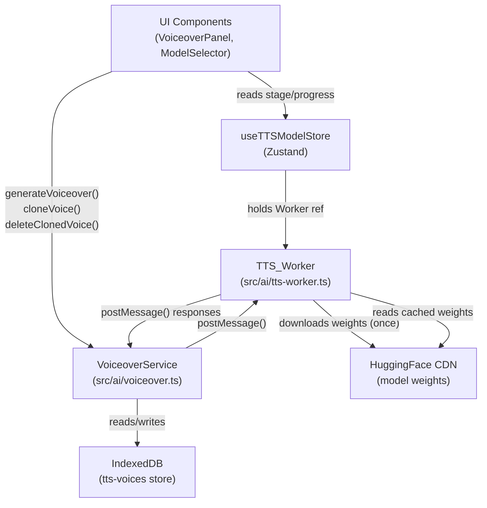

# Design Document: Local TTS / Voice Cloning

## Overview

This design replaces the stub `VoiceoverService` in `apps/web-vite/src/ai/voiceover.ts` with a real on-device TTS and voice-cloning engine. All model inference runs inside a dedicated `TTS_Worker` Web Worker using WebGPU (with WASM fallback), following the same patterns established by the Whisper transcription worker and the Gemma AI worker. No text, audio, or voice data ever leaves the user's device.

The implementation uses **OuteTTS v0.2** via the `onnx-community/OuteTTS-0.2-500M` ONNX model, accessed through `@huggingface/transformers`'s `InterfaceHF` API. Two model variants are offered: a quantized `q4f16` variant (~320 MB) for everyday use and a higher-quality `fp32` variant (~1.9 GB) for users who want better fidelity. Voice cloning is achieved by passing a reference audio prompt to the OuteTTS `create_speaker` API, with the resulting speaker embedding serialized and persisted in IndexedDB.

### Key Research Findings

- **`onnx-community/OuteTTS-0.2-500M`** is the canonical Transformers.js-compatible ONNX export of OuteTTS v0.2. It supports `device: "webgpu"` and `device: "wasm"`, and dtypes `fp32`, `fp16`, `q8`, `q4`, `q4f16`. The `InterfaceHF` API from `@huggingface/transformers` wraps model loading and generation.
- **`OuteAI/Llama-OuteTTS-1.0-1B-ONNX`** is the v1.0 1B-parameter variant with improved voice cloning quality, also Transformers.js-compatible. It is larger (~600 MB at q4f16) and serves as the "large" model option.
- **Speaker embedding / voice cloning**: OuteTTS uses an audio-prompt approach. The `tts_interface.create_speaker(audioBuffer)` call encodes a reference audio clip into a speaker descriptor (a JSON-serializable object containing per-word audio tokens). This descriptor is stored in IndexedDB and passed back to `tts_interface.generate()` as the `speaker` option.
- **Word-level timestamps**: OuteTTS v0.2 does not natively emit token-level timestamps in its ONNX export. Word timings are therefore derived via the character-weighted proportional fallback described in Requirement 4.4. If a future model version exposes timestamps, the worker can switch to native derivation without changing the public interface.
- **Speed/pitch processing**: `OfflineAudioContext` with a `AudioBufferSourceNode` whose `playbackRate` is set to `speed` handles time-stretching. Pitch shifting independent of speed requires a phase-vocoder; for the initial implementation, pitch is approximated by combining playback rate with a detune offset (`detune = 1200 * log2(pitch / speed)` cents), which is accurate for small deviations and acceptable for the declared pitch range of 0.5–2.0.

---

## Architecture



The component relationships mirror the existing transcription pipeline:

| Transcription | TTS (new) |
|---|---|
| `transcription-model-store.ts` | `tts-model-store.ts` |
| `services/transcription/worker.ts` | `ai/tts-worker.ts` |
| `services/transcription/service.ts` | `ai/voiceover.ts` (updated) |
| `transcription/models.ts` | `ai/tts-models.ts` (new) |

---

## Components and Interfaces

### File Locations

All new and modified files live under `apps/web-vite/src/`:

```
ai/
  voiceover.ts          ← modified: replace stub with real implementation
  tts-worker.ts         ← new: Web Worker for TTS inference
  tts-model-store.ts    ← new: Zustand store for TTS model lifecycle
  tts-models.ts         ← new: model variant registry
  tts-idb.ts            ← new: IndexedDB helpers for ClonedVoice persistence
```

### `tts-models.ts` — Model Registry

```typescript
export type TTSModelId = "oute-tts-small" | "oute-tts-large";

export interface TTSModel {
  id: TTSModelId;
  name: string;
  huggingFaceId: string;
  dtype: "q4f16" | "fp32";
  downloadSizeBytes: number;
  description: string;
}

export const TTS_MODELS: TTSModel[] = [
  {
    id: "oute-tts-small",
    name: "Small (Recommended)",
    huggingFaceId: "onnx-community/OuteTTS-0.2-500M",
    dtype: "q4f16",
    downloadSizeBytes: 335_000_000,   // ~320 MB q4f16 quantized
    description: "Fast, low memory. Good quality for most use cases.",
  },
  {
    id: "oute-tts-large",
    name: "Large (High Quality)",
    huggingFaceId: "OuteAI/Llama-OuteTTS-1.0-1B-ONNX",
    dtype: "q4f16",
    downloadSizeBytes: 630_000_000,   // ~600 MB q4f16 quantized
    description: "Better voice cloning fidelity. Requires more memory.",
  },
];

export const DEFAULT_TTS_MODEL: TTSModelId = "oute-tts-small";
```

### `tts-worker.ts` — Worker Message Protocol

```typescript
// ── Inbound messages (main thread → worker) ──────────────────────────────────

export type TTSWorkerMessage =
  | { type: "check" }
  | { type: "load"; modelId: string; dtype: string }
  | { type: "synthesize"; requestId: string; text: string; speakerDescriptor: SpeakerDescriptor | null; speed: number; pitch: number }
  | { type: "encode_speaker"; requestId: string; audioData: Float32Array; sampleRate: number }
  | { type: "cancel"; requestId: string }
  | { type: "terminate" };

// ── Outbound messages (worker → main thread) ──────────────────────────────────

export type TTSWorkerResponse =
  | { type: "check"; webgpuSupported: boolean; reason?: string }
  | { type: "load_progress"; progress: number }
  | { type: "load_complete"; device: "webgpu" | "wasm" }
  | { type: "load_error"; error: string }
  | { type: "synthesize_complete"; requestId: string; audioData: Float32Array; sampleRate: number; tokenTimestamps: TokenTimestamp[] | null }
  | { type: "synthesize_error"; requestId: string; error: string }
  | { type: "encode_speaker_complete"; requestId: string; descriptor: SpeakerDescriptor }
  | { type: "encode_speaker_error"; requestId: string; error: string }
  | { type: "cancelled"; requestId: string };

export interface TokenTimestamp {
  token: string;
  start: number;  // seconds
  end: number;    // seconds
}

// SpeakerDescriptor is the JSON-serializable object returned by OuteTTS
// create_speaker(). It contains per-word audio token sequences that condition
// synthesis on the reference speaker's voice characteristics.
export type SpeakerDescriptor = Record<string, unknown>;
```

### `tts-model-store.ts` — Zustand Store

```typescript
import { create } from "zustand";
import { TTS_MODELS, DEFAULT_TTS_MODEL, type TTSModelId } from "./tts-models";

export type TTSModelStage =
  | "idle"
  | "checking"
  | "downloading"
  | "loading"
  | "ready"
  | "error";

export interface TTSModelState {
  stage: TTSModelStage;
  progress: number;                    // 0–100
  error: string | null;
  device: "webgpu" | "wasm" | null;
  selectedModel: TTSModelId;
  downloadSizeBytes: number;
  worker: Worker | null;
  isReady: boolean;
}

interface TTSModelStore extends TTSModelState {
  initWorker: () => void;
  terminateWorker: () => void;
  loadModel: () => void;
  selectModel: (id: TTSModelId) => void;
  clearError: () => void;
}
```

### `voiceover.ts` — Updated Public Interface

The existing public interface is preserved exactly. The implementation is replaced:

```typescript
// Existing interfaces — unchanged
export interface VoiceProfile { ... }
export interface VoiceoverRequest { ... }
export interface VoiceoverResult { ... }

// New: ClonedVoice extends VoiceProfile with storage metadata
export interface ClonedVoice extends VoiceProfile {
  isCloned: true;
  createdAt: number;
  descriptorId: string;  // IndexedDB key for the SpeakerDescriptor
}

// New: voice cloning API (additive — does not break existing callers)
class VoiceoverService {
  // Existing methods — signatures unchanged
  getVoice(id: string): VoiceProfile | undefined
  getAllVoices(): VoiceProfile[]
  getVoicesByLanguage(language: string): VoiceProfile[]
  async generateVoiceover(request: VoiceoverRequest): Promise<VoiceoverResult>

  // New methods
  async cloneVoice(name: string, audioBuffer: AudioBuffer): Promise<ClonedVoice>
  async deleteClonedVoice(id: string): Promise<void>
  async loadClonedVoices(): Promise<void>
}
```

---

## Data Models

### IndexedDB Schema

The app's `src/db/index.ts` currently exports a null stub. The TTS feature introduces a real IndexedDB database using the native `indexedDB` API directly (no third-party library, consistent with the app's zero-server-dependency constraint).

**Database name**: `opencut-tts`  
**Version**: `1`

#### Object Store: `cloned-voices`

Stores `ClonedVoice` profile metadata.

| Field | Type | Notes |
|---|---|---|
| `id` | `string` (keyPath) | UUID, e.g. `"cloned-abc123"` |
| `name` | `string` | User-supplied display name |
| `language` | `string` | Detected or defaulted to `"en-US"` |
| `gender` | `"male" \| "female" \| "neutral"` | Defaulted to `"neutral"` |
| `age` | `"young" \| "adult" \| "senior"` | Defaulted to `"adult"` |
| `tone` | `string` | Defaulted to `"casual"` |
| `sampleRate` | `number` | From reference audio |
| `isCloned` | `true` | Discriminant field |
| `createdAt` | `number` | `Date.now()` at creation |
| `descriptorId` | `string` | FK → `speaker-descriptors` store |

#### Object Store: `speaker-descriptors`

Stores the serialized `SpeakerDescriptor` objects (OuteTTS speaker embeddings).

| Field | Type | Notes |
|---|---|---|
| `id` | `string` (keyPath) | UUID matching `ClonedVoice.descriptorId` |
| `descriptor` | `SpeakerDescriptor` | JSON-serializable OuteTTS speaker object |
| `createdAt` | `number` | `Date.now()` at creation |

Both stores are created in the `onupgradeneeded` handler. Deleting a `ClonedVoice` also deletes its corresponding `speaker-descriptors` entry in the same transaction.

### `tts-idb.ts` — IndexedDB Helpers

```typescript
export async function openTTSDatabase(): Promise<IDBDatabase>
export async function saveClonedVoice(voice: ClonedVoice, descriptor: SpeakerDescriptor): Promise<void>
export async function loadAllClonedVoices(): Promise<Array<{ voice: ClonedVoice; descriptor: SpeakerDescriptor }>>
export async function deleteClonedVoice(voiceId: string, descriptorId: string): Promise<void>
```

All functions open the database on demand (lazy init) and handle `IDBRequest` events via Promise wrappers. Quota errors from `IDBRequest.onerror` are surfaced as thrown `Error` instances with descriptive messages.

---

## Correctness Properties

*A property is a characteristic or behavior that should hold true across all valid executions of a system — essentially, a formal statement about what the system should do. Properties serve as the bridge between human-readable specifications and machine-verifiable correctness guarantees.*

### Property 1: Non-empty synthesis output

*For any* valid `VoiceoverRequest` (non-empty, non-whitespace `text` and a resolvable `voiceId`), `generateVoiceover` SHALL return a `VoiceoverResult` whose `audioBuffer.length` is greater than 0.

**Validates: Requirements 1.1**

---

### Property 2: Whitespace-only text is rejected

*For any* string composed entirely of whitespace characters (spaces, tabs, newlines, or combinations thereof), calling `generateVoiceover` with that string as `text` SHALL reject with an error, and the `VoiceoverService` state SHALL remain unchanged.

**Validates: Requirements 1.7**

---

### Property 3: Unrecognized voiceId is rejected

*For any* string that is not registered as a built-in preset ID or a `ClonedVoice` ID, calling `generateVoiceover` with that string as `voiceId` SHALL reject with an error that identifies the unrecognized ID.

**Validates: Requirements 1.8, 2.5**

---

### Property 4: getAllVoices returns built-ins plus all registered clones

*For any* set of N registered `ClonedVoice` profiles, `getAllVoices()` SHALL return a list containing all built-in presets plus exactly those N cloned profiles — no more, no fewer.

**Validates: Requirements 2.2**

---

### Property 5: Built-in preset synthesis succeeds without reference audio

*For any* built-in preset `voiceId`, calling `generateVoiceover` with that ID and no reference audio SHALL succeed and return a `VoiceoverResult` with `audioBuffer.length > 0`.

**Validates: Requirements 2.3**

---

### Property 6: Valid reference audio produces a registered ClonedVoice

*For any* audio buffer with duration in [5, 30] seconds, calling `cloneVoice` SHALL return a `ClonedVoice` profile that subsequently appears in `getAllVoices()` and can be used as a `voiceId` in `generateVoiceover`.

**Validates: Requirements 3.1, 3.2**

---

### Property 7: Reference audio longer than 30 seconds is trimmed and accepted

*For any* audio buffer with duration greater than 30 seconds, calling `cloneVoice` SHALL succeed (not reject), and the resulting `ClonedVoice` SHALL be based on at most the first 30 seconds of the input.

**Validates: Requirements 3.4**

---

### Property 8: ClonedVoice round-trip through IndexedDB

*For any* registered `ClonedVoice`, clearing the in-memory voice registry and reloading from IndexedDB (via `loadClonedVoices()`) SHALL restore the profile such that `getVoice(id)` returns the same profile and `generateVoiceover` with that `voiceId` succeeds.

**Validates: Requirements 3.5**

---

### Property 9: Deleted ClonedVoice is absent from registry and IndexedDB

*For any* registered `ClonedVoice`, calling `deleteClonedVoice(id)` SHALL result in `getVoice(id)` returning `undefined`, the ID being absent from `getAllVoices()`, and the corresponding `speaker-descriptors` entry being absent from IndexedDB.

**Validates: Requirements 3.6**

---

### Property 10: wordTimings count matches word count

*For any* valid input text, the `wordTimings` array in the returned `VoiceoverResult` SHALL contain exactly as many entries as there are whitespace-delimited words in the text after punctuation stripping, with entries ordered chronologically, `wordTimings[0].start >= 0`, and `wordTimings[last].end === audioBuffer.duration`.

**Validates: Requirements 4.1**

---

### Property 11: wordTimings shape is valid

*For any* `VoiceoverResult`, every entry in `wordTimings` SHALL have a `word` field (non-empty string), a `start` field (number ≥ 0), and an `end` field (number > `start`).

**Validates: Requirements 4.2**

---

### Property 12: Character-weighted timing fallback is proportional

*For any* text processed with the character-weighted fallback (no native timestamps), the duration assigned to each word SHALL be proportional to its character count relative to the total character count of all words.

**Validates: Requirements 4.4**

---

### Property 13: Download progress values are valid and non-decreasing

*For any* model download sequence, all emitted `progress` values SHALL be integers in [0, 100], and the sequence SHALL be non-decreasing (no progress regression).

**Validates: Requirements 5.2**

---

### Property 14: Model is initialized at most once per load cycle

*For any* number of `generateVoiceover` calls after a single successful `loadModel()`, the underlying model initialization (worker `load` message) SHALL be sent exactly once.

**Validates: Requirements 5.5**

---

### Property 15: Speed scaling adjusts duration and word timings consistently

*For any* speed value `s` in [0.5, 2.0] and any synthesized audio with original duration `d`, the returned `audioBuffer.duration` SHALL equal `d / s` and every `wordTimings` entry SHALL satisfy `adjustedStart = originalStart / s` and `adjustedEnd = originalEnd / s`.

**Validates: Requirements 7.1, 7.4**

---

### Property 16: Speed and pitch values are clamped to [0.5, 2.0]

*For any* `speed` or `pitch` value outside [0.5, 2.0], the `VoiceoverService` SHALL behave identically to a call with the value clamped to the nearest bound (0.5 or 2.0).

**Validates: Requirements 7.3**

---

### Property 17: selectModel immediately updates downloadSizeBytes

*For any* valid `TTSModelId`, calling `selectModel(id)` SHALL immediately update `useTTSModelStore.downloadSizeBytes` to equal the `downloadSizeBytes` declared in `TTS_MODELS` for that ID.

**Validates: Requirements 8.4**

---

## Error Handling

### Input Validation (VoiceoverService, main thread)

Validation runs synchronously before any worker message is sent, keeping error paths fast and avoiding unnecessary worker round-trips.

| Condition | Error message |
|---|---|
| `text` is empty or whitespace-only | `"Text must be non-empty"` |
| `voiceId` not found | `"Voice '${voiceId}' not found"` |
| `speed` or `pitch` out of range | Silently clamped; no error thrown |
| Reference audio < 5 s | `"Reference audio must be at least 5 seconds (got ${duration.toFixed(1)}s)"` |
| Reference audio > 30 s | Trimmed silently; no error thrown |

### Worker Errors (TTS_Worker)

The worker emits typed error responses that the service converts to rejected Promises:

| Worker response | Service behavior |
|---|---|
| `load_error` | Sets `stage: "error"`, rejects any pending `loadModel()` promise |
| `synthesize_error` | Rejects the specific `generateVoiceover()` promise by `requestId` |
| `encode_speaker_error` | Rejects the `cloneVoice()` promise |
| `cancelled` | Rejects the pending promise with `new Error("Cancelled")` |

### IndexedDB Errors

`tts-idb.ts` wraps all `IDBRequest` operations in Promises. On `onerror`, the error is re-thrown with a descriptive prefix:

- `"TTS storage write failed: QuotaExceededError"` — quota exhaustion
- `"TTS storage read failed: ..."` — read errors during `loadClonedVoices`
- `"TTS storage delete failed: ..."` — delete errors

The `VoiceoverService` catches these and surfaces them to callers without registering the `ClonedVoice` profile in memory.

### WebGPU Fallback

On `check` response from the worker:

```
webgpuSupported: false → load with device: "wasm", set store.device = "wasm"
webgpuSupported: true  → load with device: "webgpu", set store.device = "webgpu"
```

If WebGPU initialization fails at runtime (after `check` passes), the worker catches the error and retries with `device: "wasm"` before emitting `load_error`.

### Retry Logic

The worker uses the same exponential-backoff retry pattern as `ai-worker.js`:

- `MAX_RETRIES = 5`
- `BASE_RETRY_DELAY = 2000 ms`
- Delay formula: `BASE_RETRY_DELAY * 2^attempt`
- On each retry: emit `{ type: "load_progress", progress: cachedPercent }` to preserve UI state
- After all retries exhausted: emit `load_error`

---

## Testing Strategy

### Unit Tests

Unit tests cover specific examples, edge cases, and error conditions. They use `vitest` (already in the project) with `jsdom` for DOM APIs and manual mocks for the Web Worker and IndexedDB.

**`src/ai/__tests__/voiceover.test.ts`**
- API compatibility: `getAllVoices`, `getVoice`, `getVoicesByLanguage` return correct shapes
- Legacy ID mapping: each of the four original `DEFAULT_VOICES` IDs resolves via `getVoice`
- Auto-load: calling `generateVoiceover` with `stage: "idle"` triggers `loadModel`
- WebGPU fallback: mocking `navigator.gpu` as undefined causes `device: "wasm"` in store
- `terminateWorker`: pending `generateVoiceover` promise rejects with cancellation error
- IndexedDB unavailable: `cloneVoice` rejects and does not register the profile
- Model selection: `selectModel` transitions stage and updates `downloadSizeBytes`

**`src/ai/__tests__/tts-idb.test.ts`**
- `saveClonedVoice` + `loadAllClonedVoices` round-trip
- `deleteClonedVoice` removes both stores atomically
- Quota error surfaces as descriptive error message

**`src/ai/__tests__/tts-worker.test.ts`** (worker logic extracted to pure functions)
- `computeCharacterWeightedTimings(text, duration)` — proportional distribution
- `scaleWordTimings(timings, speed)` — scaling formula
- `clampSpeedPitch(value)` — clamping to [0.5, 2.0]
- `normalizeText(text)` — whitespace stripping and word tokenization

### Property-Based Tests

Property-based tests use **`fast-check`** (add as dev dependency: `fast-check@^3`). Each test runs a minimum of 100 iterations. Tests are tagged with the property they validate.

**`src/ai/__tests__/voiceover.properties.test.ts`**

```typescript
// Feature: local-tts-voice-cloning, Property 2: Whitespace-only text is rejected
it.prop([fc.stringMatching(/^\s+$/)])("whitespace text is rejected", async (text) => { ... });

// Feature: local-tts-voice-cloning, Property 3: Unrecognized voiceId is rejected
it.prop([fc.string().filter(s => !isKnownVoiceId(s))])("unknown voiceId is rejected", async (id) => { ... });

// Feature: local-tts-voice-cloning, Property 10: wordTimings count matches word count
it.prop([fc.string().filter(s => s.trim().length > 0)])("wordTimings count matches words", async (text) => { ... });

// Feature: local-tts-voice-cloning, Property 11: wordTimings shape is valid
it.prop([fc.string().filter(s => s.trim().length > 0)])("wordTimings entries are valid", async (text) => { ... });

// Feature: local-tts-voice-cloning, Property 12: Character-weighted timing is proportional
it.prop([fc.array(fc.string({ minLength: 1 }), { minLength: 1 }), fc.float({ min: 0.1, max: 60 })])
  ("character-weighted timings are proportional", (words, duration) => { ... });

// Feature: local-tts-voice-cloning, Property 15: Speed scaling adjusts duration and timings
it.prop([fc.float({ min: 0.5, max: 2.0 }), fc.array(fc.record({ word: fc.string(), start: fc.float(), end: fc.float() }))])
  ("speed scaling is consistent", (speed, timings) => { ... });

// Feature: local-tts-voice-cloning, Property 16: Speed/pitch clamping
it.prop([fc.oneof(fc.float({ max: 0.49 }), fc.float({ min: 2.01 }))])
  ("out-of-range speed is clamped", (speed) => { ... });

// Feature: local-tts-voice-cloning, Property 13: Progress values are valid and non-decreasing
it.prop([fc.array(fc.integer({ min: 0, max: 100 }))])
  ("progress values are non-decreasing integers", (values) => { ... });
```

Properties 1, 4, 5, 6, 7, 8, 9, 14, and 17 require the worker to be running and are tested as integration tests (see below) rather than pure property tests, since they involve the full synthesis pipeline.

### Integration Tests

Integration tests run against a real (mocked-network) worker instance using `vitest`'s worker support:

- Full `generateVoiceover` round-trip with a built-in voice (Property 1, 5)
- `cloneVoice` → `generateVoiceover` round-trip (Property 6)
- `cloneVoice` → `loadClonedVoices` → `generateVoiceover` (Property 8)
- `cloneVoice` → `deleteClonedVoice` → `getVoice` returns undefined (Property 9)
- `getAllVoices` with N registered clones (Property 4)
- `loadModel` called once for N `generateVoiceover` calls (Property 14)
- `selectModel` updates `downloadSizeBytes` (Property 17)

Network requests to HuggingFace are intercepted via `vi.stubGlobal("fetch", mockFetch)` to return pre-cached model shards, keeping integration tests offline and deterministic.
